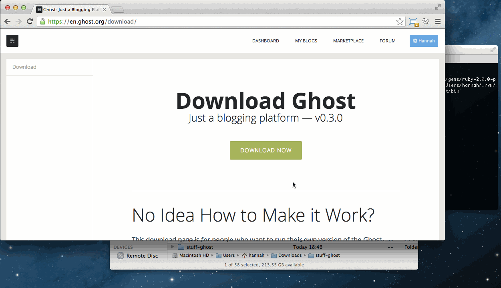
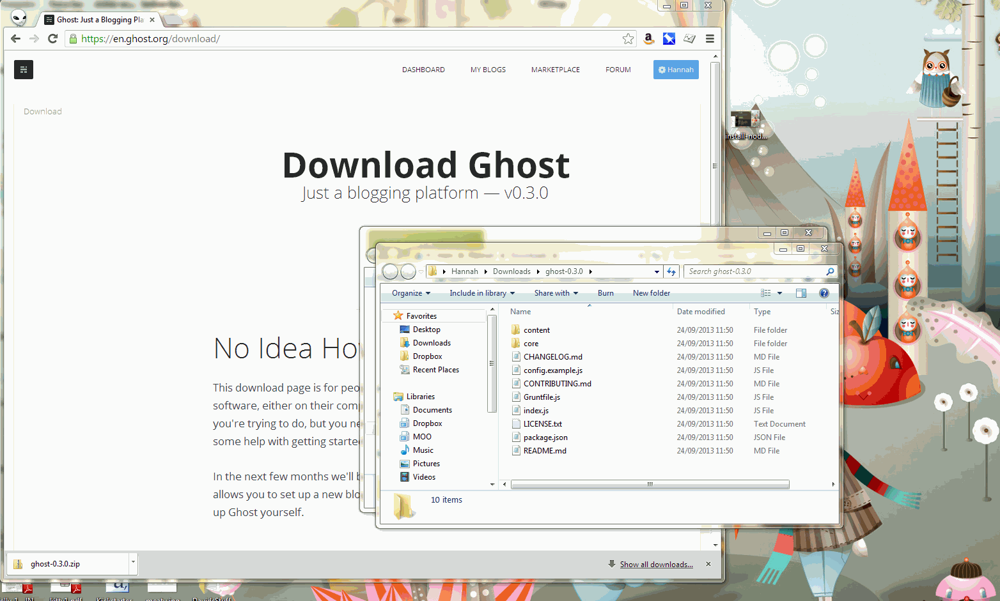
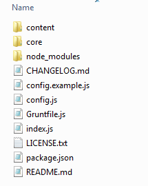
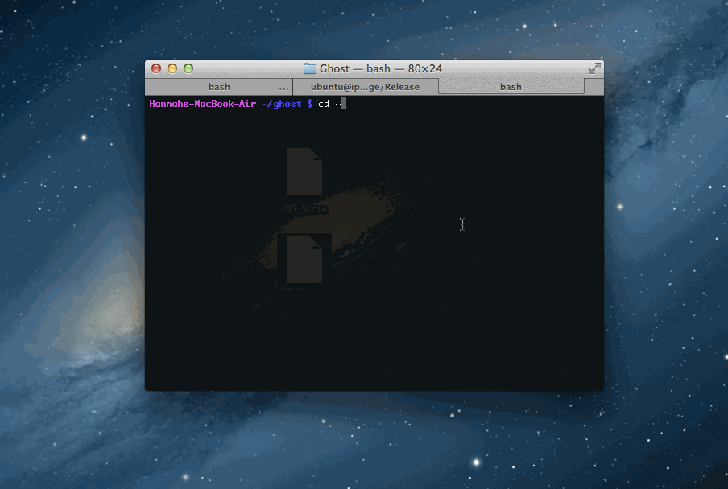

# 安装 Ghost & 开始尝试
开始搭建新的博客的第一步

## 概览
Ghost 文档还不完备，仍在继续完善中，每天可能都会有更新和改进。如果你遇到了难题或者有改进意见，请告诉我们。

Ghost 构建于 [Node.js](http://nodejs.org/) 平台之上，支持`0.10.*`版本（最新稳定版）的 Node.js。

在你的本地计算机上运行 Ghost 其实很简单，前提是你已经安装了 Node.js。

### 什么是 Node.js？
[Node.js](http://nodejs.org/) 是构建快速、扩展性良好并且高效的 web 应用的开发平台。在过去的20年间，web 从一堆静态页面进化为能够支持复杂 web 应用（例如 Gmail 和 facebook）的平台。而 JavaScript 这一编程语言是这一进程的推进剂。

[Node.js](http://nodejs.org/) 让我们具有了开发服务器端 JavaScript 程序的能力。而在以前，JavaScript 只能在浏览器上运行，如果要开发服务器端的程序，就要使用 PHP 一类的编程语言了。如果能够用同一种开发语言来完成 web 应用的开发，这将是多么棒！并且，Node.js 还赋予了前端开发工程师更大的能力。

[Node.js](http://nodejs.org/) 让这一切变为可能，其原理是对 Google Chrome 浏览器所用的 JavaScript 引擎进行了包装，让它能够跨平台运行。也就是说，你能在自己的电脑上非常快速的安装 Ghost 并让它非常快捷、方便的跑起来。 接下来我们详细讲解如何在 [Mac](http://docs.ghostchina.com/zh/installation/mac/)、[Windows](http://docs.ghostchina.com/zh/installation/window/) 或 [Linux](http://docs.ghostchina.com/zh/installation/linux/) 上安装 Ghost，另外还介绍了如何在[服务器或托管空间](http://docs.ghostchina.com/zh/installation/deploy)上部署 Ghost。

### 起步
如果你厌烦了手工安装 Node.js 和 Ghost，可以试试 [BitNami](http://bitnami.com/) 团队开发的 [Ghost 安装工具](http://bitnami.com/stack/ghost)，它提供了对所有主流平台的支持。

Ghost 支持的平台：MAC WINDOWS LINUX
如果你决定在你的服务器或托管空间上部署 Ghost，这对我们是个非常好的消息！下面的文档可以给你详细的部署指南，从手工设置到一键安装包都有涉及。

请记住，Ghost 还非常新，它的开发小组还在非常努力的实现新的功能。如果你需要升级 Ghost 到最新版本，请参考 [Ghost 升级文档](http://docs.ghostchina.com/zh/installation/upgrading/)。 如果遇到任何问题，请参考除错指南，如果你的问题还不能得到解决，请在 [Ghost 论坛](http://ghost.org/forum)提问，这里聚集了 Ghost 核心小组的成员和社区成员，他们会非常乐意帮你解决问题。

## 在 Mac 上安装
为了安装 Node.js 和 Ghost 到你的 mac 上，你需要打开一个终端窗口。你可以通过打开 spotlight 并输入 "Terminal" 打开一个终端。

### 安装 Node
- 访问 http://nodejs.org 点击 install，将会下载一个 '.pkg' 文件
- 点击下载的文件打开安装程序，将会同时安装 node 和 npm
- 点击安装程序，最后输入你的密码，并点击 “安装软件”
- 一旦安装成功，在终端窗口中输入 `echo $PATH` 检查 '/usr/local/bin/' 路径已经存在于环境变量中
> **注意:** 如果 '/usr/local/bin' 没有添加到 $PATH 环境变量， 查阅 [故障排除提示](http://docs.ghostchina.com/zh/installation/troubleshooting#export-path) 解决这个问题。

如果你遇到了困难，可以查阅 [这里](https://s3-eu-west-1.amazonaws.com/ghost-website-cdn/install-node-mac.gif)

### 安装并运行 Ghost
- 登录到 http://ghost.org，然后点击蓝色的 'Download Ghost Source Code' 按钮
- 在下载页，点击下载最新的 zip 压缩文件
- 点击最新下载的文件的下拉箭头，选择 '在文件夹中显示'
- 双击下载的 zip 文件解压它
- 然后，将解压的 'ghost-#.#.#' 文件拖放到打开的终端窗口的标签页上，此时会在该路径下打开一个新的终端标签页
- 在新的终端标签页输入 `npm install --production` `注意是两个 -`
- 当 npm 安装成功，输入 `npm start` 启动开发模式下的 Ghost
- 在浏览器中，访问 `127.0.0.1:2368` 即可查看最新搭建的 Ghost 博客
- 访问 `127.0.0.1:2368/ghost` 并且设置管理员用户并登陆 Ghost 管理员
- 下一节 [使用说明](http://docs.ghostchina.com/usage) 会介绍 Ghost 的使用



## 在 Windows 上安装

### 安装 Node
- 访问 http://nodejs.org 点击 install， 将会下载一个 '.msi' 文件。
- 点击该文件启动一个安装程序，这将会安装 Node 和 npm。
- 通过安装程序一步一步完成安装，直到屏幕上显示你已经成功安装 Node.js。
如果你遇到了困难，可以查阅 [这里](https://s3-eu-west-1.amazonaws.com/ghost-website-cdn/install-node-win.gif)

### 下载 & 获取 Ghost
- 登录到 http://ghost.org，然后点击蓝色的 'Download Ghost Source Code' 按钮。
- 在下载页，点击按钮下载最新的 zip 文件。
- 点击最新下载的文件的下拉箭头，选择 '在文件夹中显示' 。
- 当打开文件夹后，右键选择解压所有文件。
如果你遇到了困难，可以查阅 [这里](https://s3-eu-west-1.amazonaws.com/ghost-website-cdn/install-ghost-win.gif)

### 安装并运行 Ghost
- 在开始菜单里，找到 'Node.js' 然后点击选择 'Node.js Command Prompt' 。
- 在 Node.js command prompt 中，切换到解压的 Ghost 文件夹目录下。输入：`cd Downloads/ghost-#.#.# `（替换 `# `为你下载的 Ghost 的版本）。
- 然后，在命令行中输入 `npm install --production` `注意是两个 -`
- 当 npm 安装成功后，输入 `npm start `启动开发模式下的 Ghost。
- 在浏览器中，访问 `127.0.0.1:2368` 即可查看最新搭建的 Ghost 博客。
- 访问 `127.0.0.1:2368/ghost` 并且设置管理员用户并登陆 Ghost 管理员。
- 下一节 [使用说明](http://docs.ghostchina.com/usage) 会介绍 Ghost 的使用。


## 在 Linux 上安装

### 安装 Node
- 你可以通过从 http://nodejs.org 下载 `.tar.gz` 存档或者是通过包管理器安装。你可以根据 [这篇文章](https://github.com/joyent/node/wiki/Installing-Node.js-via-package-manager) 的说明来从包管理器安装 Node
- 通过在终端窗口中输入 `node -v `和 `npm -v`检查 Node 和 npm 是否安装成功

### 安装并运行 Ghost
- 登录到 http://ghost.org，然后点击蓝色的 'Download Ghost Source Code' 按钮
- 在下载页，点击下载最新的 zip 压缩文件然后将文件解压到你想运行 Ghost 的地方
**如果你以 guest 身份登陆的 linux 或者以 SSH 远程连接只有终端，那么：**

- 使用以下命令下载 Ghost 的最新版：

```
$ curl -L https://ghost.org/zip/ghost-latest.zip -o ghost.zip
```

- 使用以下命令解压存档：

```
$ unzip -uo ghost.zip -d ghost
```

**在你解压好之后，打开一个终端：**

- 切换到刚才解压的 Ghost 文件夹目录下

```
$ cd /你的 Ghost 解压目录
```

- 输入以下命令安装 Ghost ：

```
npm install --production
```

`注意是两个 -`

- 在 npm 结束安装后，输入以下命令让 Ghost 以开发模式启动：

```
$ npm start
```

- Ghost 将会运行在 **127.0.0.1:2368**
`你可以在 config.js 中修改 IP 地址和端口`

- 在浏览器中，访问 `127.0.0.1:2368` 即可查看最新搭建的 Ghost 博客

- 访问 `127.0.0.1:2368/ghost` 并且设置管理员用户并登陆 Ghost 管理员

## 开始 Ghost 之旅
准备好开始 Ghost 之旅了吗？ OK !

第一个需要你做的决定就是，是否选择自己手动安装 Ghost ，还是选择从安装程序安装。

### 安装程序安装
目前有以下几种使用简单的安装程序安装的方法：

- 部署到 [Bitnami](http://wiki.bitnami.com/Applications/BitNami_Ghost)
- 使用 [Rackspace deployments](http://developer.rackspace.com/blog/launch-ghost-with-rackspace-deployments.html) 启动 Ghost
- 搭建在 [DigitalOcean Droplet](https://www.digitalocean.com/community/articles/how-to-use-the-digitalocean-ghost-application)

### 手动安装
你需要一个主机空间，或者可以安装 [Node.js](http://nodejs.org/) 的服务器。 这意味着着比如云空间 ([Amazon EC2](http://aws.amazon.com/ec2/)， [DigitalOcean](http://www.digitalocean.com/)， [Rackspace Cloud](http://www.rackspace.com/cloud/))， VPS ([Webfaction](https://www.webfaction.com/)， [Dreamhost](http://www.dreamhost.com/servers/vps/)) 或者其他拥有 SSH (terminal) 并且允许安装 Node.js 的平台。目前有很多这种比较便宜的平台。

目前还不能在 cPanel 风格的共享主机（通常用于 PHP）上运行。虽然有些（cPanel）支持 Ruby 将来也许支持 Node.js 的主机也同样不行。

不幸的是，一些 Node.js 主机提供商比如说 **Nodejitsu** 和 **Heroku** 与 Ghost 并不兼容。它们会工作，但会删除你的文件，所以你上传的图片和数据库的内容都会消失。Heroku 支持 MySQL 数据库，你可以使用它来弥补这个问题，但你仍然会丢失一些上传的图片。

以下链接包含了如何开始和运行的说明：

- [Dreamhost](http://www.howtoinstallghost.com/how-to-install-ghost-on-dreamhost/) - from [howtoinstallghost.com](howtoinstallghost.com)
- [DigitalOcean](http://ghosted.co/install-ghost-digitalocean/) - from [Corbett Barr](http://ghosted.co/)
- [Webfaction](http://www.howtoinstallghost.com/how-to-install-ghost-on-webfaction-hosting/) - from [howtoinstallghost.com](howtoinstallghost.com)
- [Rackspace](http://ghost.pellegrom.me/installing-ghost-on-ubuntu/) (Ubuntu 13.04 + linux service) - from [Gilbert Pellegrom](http://ghost.pellegrom.me/)
- [Ubuntu + nginx + forever](http://0v.org/installing-ghost-on-ubuntu-nginx-and-mysql/) - from [Gregg Housh](http://0v.org/)
- ...check the [installation forum](https://en.ghost.org/forum/installation) for more guides ...

## 让 Ghost 一直运行
前面提到的启动 Ghost 使用 `npm start` 命令。这是一个在开发模式下启动和测试的不错的选择，但是通过这种命令行启动的方式有个缺点，即当你关闭终端窗口或者从 SSH 断开连接时，Ghost 就停止了。为了防止 Ghost 停止工作，有两种方式解决这个问题。

### Forever (https://npmjs.org/package/forever)
你可以使用 `forever` 以后台任务运行 Ghost 。`forever` 将会按照 Ghost 的配置，当进程 crash 后重启 Ghost。

- 通过 `npm install forever -g` 安装 `forever`
- 为了让 `forever` 从 Ghost 安装目录运行，输入 `NODE_ENV=production forever start index.js`
- 通过 `forever stop index.js` 停止 Ghost
- 通过 `forever list` 检查 Ghost 当前是否正在运行

### Supervisor (http://supervisord.org/)
流行的 Linux 发行版——例如 Fedora， Debian 和 Ubuntu，都包含一个 Supervisor 包：一个进程控制系统，允许在启动的时候无需初始化脚本就能运行 Ghost。不像初始化脚本一样，Supervisor 可以移植到不同的发行版和版本。

- 根据不同的 Linux 发行版 [安装 Supervisor](http://supervisord.org/installing.html)。如下所示：
 - Debian/Ubuntu： `apt-get install supervisor`
 - Fedora： `yum install supervisor`
 - 其他大多数发行版： `easy_install supervisor`
- 通过 `service supervisor start` 确保 Supervisor 运行
- 为 Ghost 创建一个启动脚本。通常为 `/etc/supervisor/conf.d/ghost.conf` ，例如：

```
[program:ghost]
command = node /path/to/ghost/index.js
directory = /path/to/ghost
user = ghost
autostart = true
autorestart = true
stdout_logfile = /var/log/supervisor/ghost.log
stderr_logfile = /var/log/supervisor/ghost_err.log
environment = NODE_ENV="production"
```

- 使用 Supervisor 启动 Ghost：`supervisorctl start ghost`
- 停止 Ghost： `supervisorctl stop ghost`

详细内容请参阅 [Supervisor 文档](http://supervisord.org/)。

### 初始化脚本
Linux 系统在启动的时候会运行初始化脚本。这些脚本通常存在于 /etc/init.d 。为了让 Ghost 一直运行下去甚至自动重启，你可以设置一个初始化脚本来完成这个任务。以下的例子工作在 Ubuntu ，并且在 **Ubuntu 12.04** 下测试通过。

- 使用以下命令创建 /etc/init.d/ghost 文件：

```
$ sudo curl https://raw.github.com/TryGhost/Ghost-Config/master/init.d/ghost \
  -o /etc/init.d/ghost
```

- 使用 `nano /etc/init.d/ghost` 命令打开文件并检查以下内容：

- 将 `GHOST_ROOT` 变量的值更换为你的 Ghost 安装路径

- 检查 `DAEMON` 变量的值是否和 `which node` 的输出值相同

- 这个初始化脚本将在你的系统上以它自己的 Ghost 用户和用户组运行，使用以下命令来创建：

```
$ sudo useradd -r ghost -U
```

- 确保 Ghost 用户可以访问安装目录：

```
$ sudo chown -R ghost:ghost /你的 Ghost 安装目录
```

- 使用以下命令给这个初始化脚本加上可执行权限：

```
$ sudo chmod 755 /etc/init.d/ghost
```

- 现在你可以使用以下的命令来控制 Ghost ：

```
$ sudo service ghost start
$ sudo service ghost stop
$ sudo service ghost restart
$ sudo service ghost status
```

- 为了让 Ghost 能在系统启动时同时启动，我们必须要将刚刚创建的初始化脚本注册为为启动项。 执行以下两个命令：

```
$ sudo update-rc.d ghost defaults
$ sudo update-rc.d ghost enable
```

- 为了保证你的用户可以更改 Ghost 目录里的文件和默认的 config.js ，需要将你加入 ghost 用户组中： `$ sudo adduser 你的用户名 ghost`

- 如果你现在重启你的服务器，Ghost 应该会自动运行。

使用 forever 和如何在 ubuntu 下建立 Ghost 守护进程的文档即将发布！

## 配置 Ghost 域名

如果你已经让 Ghost 一直运行了，你也可以设置一个代理服务器让你的博客可以使用域名访问。以下的示例假定你的操作系统是 **Ubuntu 12.04** ，使用 **Nginx** 作为你的Web服务器，已经使用以上任意一种方法让 Ghost 在后台运行。

- 安装 nginx

```
$ sudo apt-get install nginx
```

`这个命令将会安装nginx并且设定好所有必需的目录和基础配置。`

- 配置你的站点

 - 在 `/etc/nginx/sites-available` 创建一个 `ghost.conf` 文件
 - 使用文本编辑器打开这个文件 (e.g. `sudo nano /etc/nginx/sites-available/ghost.conf`) 把以下内容复制进这个文件

```
	server {
	    listen 80;
	    server_name example.com;
	
	    location / {
	        proxy_set_header   X-Real-IP $remote_addr;
	        proxy_set_header   Host      $http_host;
	        proxy_pass         http://127.0.0.1:2368;
	    }
	}
```

 - 将 `server_name` 的值改为你的域名

 - 把你的配置文件软链接到 `sites-enabled` 文件夹下:

```
$ sudo ln -s /etc/nginx/sites-available/ghost.conf /etc/nginx/sites-enabled/ghost.conf
```

 - 重启 nginx
```
$ sudo service nginx restart
```

## 更新 Ghost
更新 Ghost 是非常简单的。

有几种方法可供选择。下面描述了将会发生什么，并且你要按照 [点击风格](http://docs.ghostchina.com/zh/installation/upgrading/#how-to) 和通过一个 [命令行](http://docs.ghostchina.com/zh/installation/upgrading/#cli) 一步步实现。所以你可以自由选择感觉最舒适的方法。

> **备份！** 总是在更新前执行一次备份。首先请阅读 [备份指南](http://docs.ghostchina.com/zh/installation/upgrading/#backing-up)。

## 概述
Ghost 安装后，有一个与左边图片相似的文件夹结构，包括两个主要的目录 `content` 和 `core` ，和其他一些文件。

更新 Ghost 也无非就是将旧文件替换为新文件，重新运行 `npm install` 更新 `node_modules` 文件夹，然后重新启动 Ghost 使生效。

记住，Ghost 默认将所有的自定义数据，主题，图片等存储到 `content` 目录下，所以确保此目录安全！只替换 `core` 目录和根目录下的文件，一切就会正常。


## 备份
- 为了备份你的数据库中的所有数据，启动 Ghost 访问 `/ghost/debug/` 并且登录。点击蓝色的 `EXPORT` 按钮，将会下载下一个包含你所有数据的 JSON 文件。
- 为了备份你的所有的自定义主题和图片，你需要复制一份 `content/themes` 和 `content/images` 内的文件。
> **注意:** 如果你喜欢的话，你也可以通过复制 `content/data` 实现数据库的备份。但是 **记住** 要先停止 Ghost 后再去复制。

## 如何更新
如何更新本地机器上的 Ghost 呢？

> **警告: 不要**在 mac 现有的安装上复制和粘贴整个 Ghost 文件夹。在使用 Transmit 或者其他 FTP 工具上传的时候，**不要**选择 **REPLACE** 而要选择 **MERGE**。

- 从 [Ghost.org](http://ghost.org/download/) 下载最新版本的 Ghost
- 解压 zip 文件到一个临时的目录下
- 复制所有的根目录下的文件，包括：index.js， package.json， Gruntfile.js， config.example.js 和 license 、 readme 文件
- 下一步用新的 `core `目录替换旧的 `core `目录
- 版本发布的更新包括 Casper （默认的主题），所以用新的替换 `content/themes/casper`
- 运行 `npm install --production`
- 最后，重启 Ghost 使改变生效

## 使用命令行
> 备份！ 总是在更新前执行一次备份。首先请阅读 [备份指南](http://docs.ghostchina.com/zh/installation/upgrading/#backing-up) 。

### 在 mac 上使用命令行
下面的截屏视频显示了如何按步更新 Ghost ，在从下载了 zip 文件到 `~/Downloads` 并且安装 Ghost到` ~/ghost` 的前提下。`**注意：**~在 mac 和 linux 中表示用户主目录。`



步骤如下：

- `cd ~/Downloads` - 切换到下载的最新版本 Ghost 所在的目录
- `unzip ghost-0.3.1.zip -d ghost-0.3.3` - 解压 ghost 为 ghost-0.3.3
- `cd ghost-0.3.3` - 进入 `ghost-0.3.3` 目录内
- `ls` - 显示当前目录下所有文件和文件夹
- `cp *.md *.js *.txt *.json ~/ghost`- 复制所有 `~/ghost` 目录下的 .md .js .txt 和 .json 文件
- `cp -R core ~/ghost `- 复制 `core `目录和它包含的所有内容到 `~/ghost`
- `cp -R content/themes/casper ~/ghost/content/themes` - 复制 `casper` 目录和它包含的所有文件到 `~/ghost/content/themes`
- `cd ~/ghost` -切换到 `~/ghost` 目录下
- `npm install --production` - 安装 Ghost
- `npm start` - 启动 Ghost

### 在 linux 上使用命令行
- 首先你需要知道最新版本 Ghost 的 URL。通常为 `http://ghost.org/zip/ghost-latest.zip`
- 通过 `wget http://ghost.org/zip/ghost-latest.zip` 下载最新的 zip 文件（或者带着版本号的 Ghost 文件的 URL）
- 使用 `unzip -uo ghost-0.3.*.zip -d path-to-your-ghost-install` 解压
- 运行 `npm install --production` 安装最新的依赖包
- 最后，重启 Ghost 使生效
**此外**， [howtoinstallghost.com](howtoinstallghost.com) 也介绍了如何在 linux 上更新 Ghost。

### 如何更新 DigitalOcean Droplet
> **备份！** 总是在更新前执行一次备份。首先请阅读 [备份指南](http://docs.ghostchina.com/zh/installation/upgrading/#backing-up) 。

- 首先你需要知道最新版本 Ghost 的 URL。通常为 `http://ghost.org/zip/ghost-latest.zip`
- 一旦你获取了最新版本的 URL ，在你的 Droplet 控制台中输入 `cd /var/www/` 切换到 Ghost 代码库
- 下一步，输入 `wget http://ghost.org/zip/ghost-latest.zip` （或者带着版本号的 Ghost 文件的 URL）
- 使用 `unzip -uo ghost-0.3.*.zip -d ghost `解压
- 使用 `chown -R ghost:ghost ghost/*` 确保所有文件都拥有正确的权限
- 运行 `npm install` 安装最新的依赖包
- 最后，使用 `service ghost restart` 重启 Ghost 使改变生效

## 怎样更新 Node.js 到最新版本

如果你最初已经从 [Node.js](http://docs.ghostchina.com/zh/installation/upgrading/nodejs.org) 安装了 Node.js 了，你可以通过下载并安装最新版本的 Node.js 实现更新。这样新版本会覆盖之前安装的旧版本。

如果你使用的 Ubuntu，或者其他 linux 的发行版，你可以使用以下命令安装： `sudo apt-get install nodejs` 。

你**不必**重启服务器或者 Ghost 。

## 纠错 & 常见问题
**'/usr/local/bin' 没有添加到 $PATH**
你可以使用以下步骤添加它：
 - 在你的终端窗口中输入 `cd ~`，切换到主目录
 - 然后输入 `ls -al` 显示当前文件夹内所有文件，包括隐藏的文件
 - 你应该看到一个名为 `.profile` 或者 `.bash_profile` 的文件。如果没有，输入 `touch .bash_profile` 创建这个文件
 - 输入 `open -a Textedit .bash_profile` ，用 Textedit 打开这个文件
 - 添加 `export PATH=$PATH:/usr/local/bin/` 到这个文件的尾部并保存
 - 这个新的设置将会在一个新的终端启动时载入，所以打开一个新的终端标签页或窗口，输入 `echo $PATH` ，你可以看到 '/usr/local/bin/' 现在存在了
**SQLite3 没有安装**
SQLite3 包采用的预构建的二进制文件适应大多数架构。如果你使用的不常用的 linux 或者 unix 版本，你可能发现 SQLite3 报 404 错误，也就是说系统找不到这个二进制文件。

可以强制编译 SQLite3 解决这个问题。这样的话需要 python & gcc ，尝试运行 `npm install sqlite3 --build-from-source`。

如果你缺失 python 或者 gcc 组件，在 linux 下运行 `sudo npm install -g node-gyp`， `sudo apt-get install build-essential` 和 `sudo apt-get install python-software-properties python g++ make `然后再重新尝试从源代码编译。

更多关于构建二进制文件的信息参阅： https://github.com/developmentseed/node-sqlite3/wiki/Binaries

一旦你成功在你的平台上构建了二进制文件，按照 [这里的说明](https://github.com/developmentseed/node-sqlite3/wiki/Binaries#creating-new-binaries) 的步骤提交你的 node-sqlite 项目，这样其他的用户就不会遇到同样的问题了。

**我不能上传图片**
如果你在 DigitalOcean Droplet 上安装 Ghost v0.3.2 ，或者在其他平台上使用了 nginx，你可能发现不能上传图片。

实际情况是，你不能上传超过 1 MB 的图片（尝试上传小的图片），这只是一个小限制而已。

为了提高限额，你可以编辑 nginx 配置文件来调整限制。

 - 登录到你的服务器，然后输入 `sudo nano /etc/nginx/conf.d/default.conf` 打开你的配置文件
 - 在 `server_name `下一行，添加如下代码： `client_max_body_size 10M;`
 - 最后，使用 ctrl + x 退出。Nano 将会询问你是否保存，输入 y 确认，然后按下 enter 保存文件