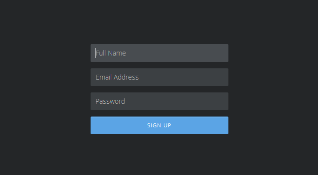
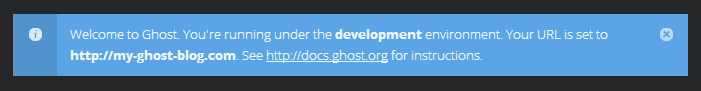
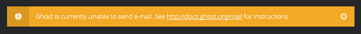
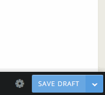
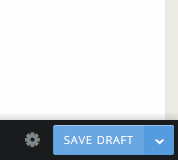
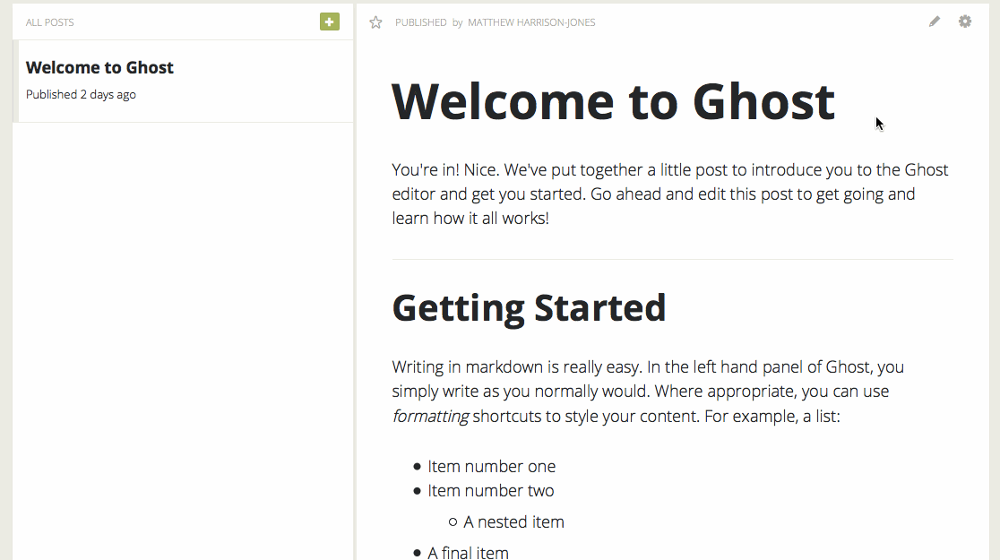
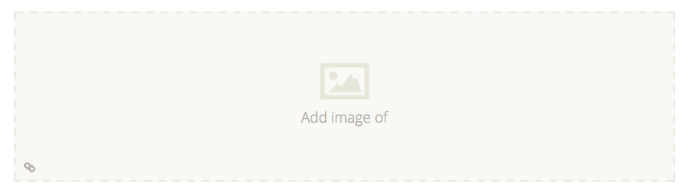
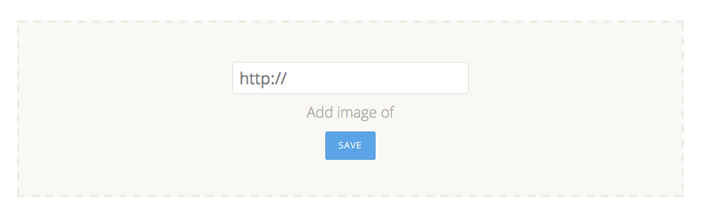

# 使用 Ghost
寻找您的周围，设置您想要的方式

##概述
希望到这一步，您已经安装和启用了 Ghost，并且准备好了博客。以下的各节将引导您通过您需要知道的关于 Ghost 的所有内容，让您熟悉一切事情，建立您想要的博客。

### 第一步
如果您第一次运行 Ghost，那么您需要创建您的管理员用户帐户。在您最喜爱的浏览器中访问您的新博客，然后将 URL 更改为`<你的 URL>/ghost/signup/`。您应该看到一个这样的画面：

- 填写您的 **姓名** 作为您想要在博文作者中出现的名称。
- 然后输入您的**电邮地址** - 确保它是有效的，并输入一个合理的**密码**（需要至少8个字符）。
- 点击大的蓝色的 **Sign Up** 按钮, 您将会登入您的博客中。
这就是这样！您现在可以开始写博客文章。

消息

在您第一次运行 Ghost 时您应该在屏幕的顶部看到一个蓝色的通知消息，看起来有点像这样：

这使您了解一些关于 Ghost 的配置方式，比如您的运行环境和您设置的 URL。跳转到[配置](http://docs.ghostchina.com/usage/configuration/) 部分以了解更多有关环境的信息和如何配置 Ghost。您在登录前不能摆脱这条通知（这是一个错误，我们正在努力改正它），但是您一旦看完并熟悉了这条通知后，点击 x 关闭它。它就不会再次出现。

您还可以看到关于电子邮件的橙色预警消息，： 

这对于您建立博客不起决定性的作用，所以您可以开始编写博文，你可以浏览[电子邮件文档](http://docs.ghostchina.com/mail) 并了解如何配置 Ghost 使其能发送电子邮件。它目前仅用于在您忘记密码时向您发送一个密码重置电子邮件。它对于博客不重要，但如果您需要，它将真的很有用。

## 配置 Ghost
在您第一次运行 Ghost 后，您会在 Ghost 的根目录中发现一个 `config.js` 文件 ，伴随着 `index.js` 文件。该文件允许您设置环境之类的配置信息，比如您的网址，数据库和邮件设置。

如果尚未第一次运行 Ghost，您不会有这个文件。您可以通过复制 `config.example.js` 创建一个文件 - 那是 Ghost 一开始就创建的。

配置您的 Ghost URL，邮件或数据库设置，您喜欢的编辑器打开 `config.js` ，并开始将设置改变为您想要的环境。如果环境您没有遇到，请阅读下面的文档。

## 关于环境
Node.js 和源于 Node.js 的 Ghost 具有内置环境的概念。环境允许您在可能运行的不同的模式中创建不同的配置。默认情况下，Ghost 有两个内置的模式：**开发模式**和**生产模式**。

在两种模式或环境之间有一些非常细微的差别。本质上讲**开发模式**用于开发特别是 Ghost 的调试。同时当您公开运行 Ghost 的时候，使用“生产模式”。这些差异包括输出日志和错误消息，多少静态资源被串联和压缩等。在**生产模式**，您会得到一个包含了管理所需的所有代码的 JavaScript 文件，在**开发模式**，您会得到多个文件。

随着 Ghost 的推进，这些差异将增长并变得更加明显，所以在**生产模式**环境中运行公开博客将越来越重要。或许这引出了一个问题，为什么在大多数人都将要它运行在**生产模式**时，默认的是**开发模式？**Ghost 默认使用**开发模式**是因为它是最好的调试的环境，当您首次设置时，您可能最需要的环境。

## 使用环境
为了设置 Ghost 运行在不同的环境下，您需要使用环境变量。例如，如果您使用 `node index.js` 正常启动 Ghost 您可以用：

`NODE_ENV=production node index.js`

或者，如果您永远正常使用：

`NODE_ENV=production forever start index.js`

或者，如果您使用 `npm start` 启动 Ghost，您可以用稍微容易记住的方式：

`npm start --production`

### 为什么使用 `npm install --production`？
我们被问了好几次，为什么Ghost默认运行在开发模式，而安装文档却说运行 `npm install --production` ？这是一个很好的问题！如果您在安装Ghost时不包含 `--production` ，并不会产生什么问题，但它会安装额外的仅仅是对想要开发 Ghost 核心的人有用的软件包。这也需要您有一个特定的包，使用 `npm install -g grunt-cli` 命令安装在全局中的 `grunt-cli` 包，如果您只是想作为一个博客运行 Ghost 的话，它是不是必需的。

## Ghost 设置

转到`<your URL>/ghost/settings/`.

您设置调整完成，必须按“保存”按钮，保存更改。

您可以通过浏览博客URL，检查您的更改。

### 博客 (`/general/`)
这些事博客的具体设置。

- **Blog Title: **更改您的博客标题。主题引用`@blog.title`。
- **Blog Description:** 更改您的博客描述。主题引用 `@blog.description`。
- **Blog Logo:** 为您的博客上传一个'.png'， '.jpg'或者'.gif'格式的Logo。主题引用 `@blog.logo`。
- **Blog Cover:** 为您的博客上传'.png'，'.jpg'或者'.gif'格式的封面图片。主题引用`@blog.cover`。
- **Email Address:** 通过电子邮件向管理员发送通知的电子邮件地址。它必须是一个有效的电子邮件地址。
- **Posts per page:** 设置每页显示多少篇文章。这应该是一个数值。
- **Theme:** 在您的 `content/themes `目录中列出所有的主题。从下拉列表中选择一个会改变您的博客样式。

### 用户设置 (/user/)
这些设置控制您的用户名/作者简介。

- **Your Name: **这是您的名字，当您发布一篇文章时记录您。主题引用（post） `author.name`。
- **Cover Image:** 这里上传您的个人资料封面图片，用'.png'，'.jpg'或'.gif'格式。 主题引用（post）`author.cover`。
- **Display Picture: **这里上传您的个人展示图片，用'.png'，'.jpg'或'.gif'格式。 主题引用（post） `author.image`。
- **Email Address: **此电子邮件将作为您的公共电子邮件也是您希望收到通知的地址。主题引用（post） `author.email`。
- **Location: **这是您目前的位置。主题引用（post） `author.location`。
- **Website: **这是您个人网站的网址，或是是您的社交网络网址之一。主题引用（post） `author.website`。
- **Bio:** 这里您可以输入不超过200字符的自我描述。主题引用（post） `author.bio`。

更改您的密码
1. 输入框中填写相应的密码（当前/新的密码）。
2. 现在点击 **Change Password.**
> **Note:**对于您的密码改变，您必须点击“Change Password”按钮，“Save”按钮不更改密码。

## 管理您的博客

1. 转到`<your URL>/ghost/editor/`
2. 输入文章标题
3. 输入使用 [Markdown](http://daringfireball.net/projects/markdown/syntax) 您的文章内容
4. 通过点击'Save Draft'按钮将您的文章保存为"草稿"， 过着按 Ctrl / CMD + S.

### 发布一篇文章
您已经写完您的文章

1. 点击旁边的箭头"Save Draft"
2. 选择"Publish Now"

这将设置保存状态为立即发布（'Publish Now'），一旦您按下这个按钮，文章将被发布，按钮会变红。返回文章的'Draft'状态;

1. 返回到'Save Menu'。
2. 选择"Unpublish"。
3. 点击"Unpublish"按钮。
改变已发文章的"Slug"或"Publish date";

1. 点击'Settings'图标。
2. 继续更新所需要的信息 (当您离开后会自动保存). 

###删除一篇文章
1. 在“内容”页面或“编辑”页，导航到'Settings'图标。
2. 点击"Delete"。
3. 同删除（Accept the Modal ） 

## 写文章
在 Ghost 中的写博客文章都用 Markdown。Markdown 使用标点符号和特殊字符格式标记文档的轻量级语言。它的语法是为了防止中断写作的流动，让您专注于内容，而不是它看起来如何。

### Markdown 指南
[Markdown](http://daringfireball.net/projects/markdown/) 是一种标记语言，旨在提高写作效率，并保证写作尽可能易读。

Ghost 使用了 Markdown 默认的所有快捷方式加上我们自己的添置。下面列出了完整的快捷键列表。

标题

可以在标题内容前输入#设定标题。标题内容前#的数字决定标题的深度。标题深度从1至6。

- H1 : `# 标题 1`
- H2 : `## 标题 2`
- H3 : `### 标题 3`
- H4 : `#### 标题 4`
- H5 : `##### 标题 5`
- H6 : `###### 标题 6`

文本样式

- 链接 : `[标题](URL)`
- 粗体 : `**粗体**`
- 斜体 : `*斜体*`
- 段落 : `段落间行空间`
- 列表 :` * 每个列表项前的星号`
- 引用 :` > 引用`
- 代码 : `代码`
- HR : `==========`

图片

要在您的文章插入一个图像，你要先在 Markdown 编辑器面板中输入``。 这会在预览面板中创建一个图像上传框。

现在，您可以从桌面拖动和删除任何图像(.png, .gif, .jpg) 到图像上传框，把它列入您的文章中，或者点击图片上传框使用标准图像上传弹出窗口。 如果你想输入图片 url，点击图像上传框左下方的'link'图标，这会为您提供插入图像的 URL 的功能。

给你的图片加上标题，你需要在方括号中填写你的标题文字，例如；``.

删除图片

要删除图像，请在当前插入图像的右上角单击“remove”图标。这会给你提供空白的图片上传框让你重新插入一个新的图片。

## 常见问题集

###(何时) Ghost 支持 X 功能吗？
请参阅 [Github wiki](https://github.com/TryGhost/Ghost/wiki) 上的 [Planned Features](https://github.com/TryGhost/Ghost/wiki/Planned-Features) 列表和 [Roadmap（路线图）](https://github.com/TryGhost/Ghost/wiki/Roadmap)

### 怎样给文章插入图片？
在 Ghost 编辑器中图片上传是如何工作的完整说明，请参阅 [Markdown 指南](http://docs.ghostchina.com/usage/writing/#markdown)。